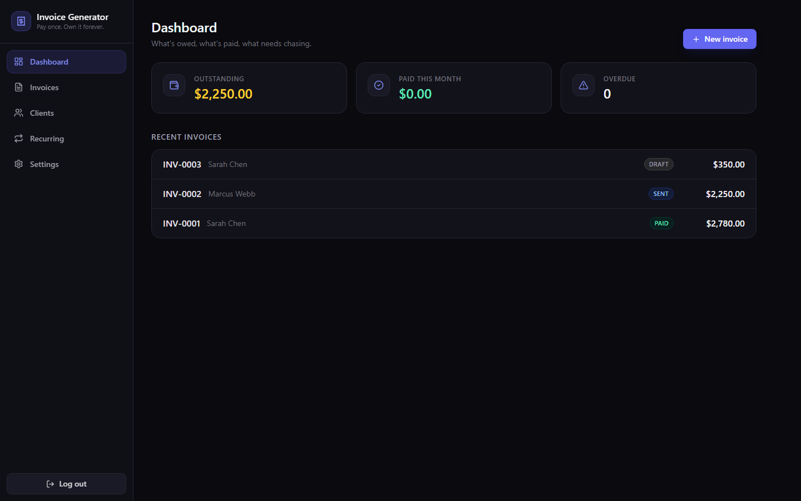

# 🧾 Invoice Generator

## Demo


https://github.com/user-attachments/assets/4dc10794-2602-486c-8b99-b42be5ed1d66


**Self-hosted invoicing for freelancers and small businesses. Pay once. Own it forever. No subscription.**

FreshBooks charges **$19/month, forever**, to store *your* client list and send *your* invoices from *their* servers. Invoice Generator is the same core workflow — clients, invoices, PDFs, shareable payment links, recurring billing — running entirely on your machine (or your $5 VPS). Your client data never leaves hardware you control.



## Features

- **Business profile** — name, logo upload, address, tax ID, currency, payment/bank instructions printed on every invoice
- **Clients** — full CRUD with company, email, address, notes
- **Invoices** — line items (qty × rate), tax %, discount %, notes, due dates, configurable numbering (prefix + auto-increment)
- **Statuses** — draft / sent / paid, with **overdue computed automatically** from the due date
- **Professional PDFs** — clean server-side template (pdfkit, no headless browser) with your logo, status pill, and payment details
- **Public share links** — send clients `/inv/<token>`: they see a polished invoice page and can download the PDF, no login required
- **Dashboard** — outstanding total, paid this month, overdue list at a glance
- **Recurring invoices** — monthly templates auto-create drafts via an in-process scheduler; optionally auto-email them (BYO SMTP)
- **Email invoices** — one click, PDF attached, via any SMTP provider (Gmail app password, Mailgun, Postmark…)
- **100% local** — SQLite database, no telemetry, no external services

## Quick start (desktop app — recommended)

Runs as a normal desktop app. Data lives in your OS user profile; no password needed.

```bash
npm i
npm run build
npm run desktop
```

## Run as a web app (for your VPS)

Need clients to open invoice links from anywhere? Deploy the exact same app to a $5 VPS:

```bash
npm i
npm run build
cp .env.example .env   # set ADMIN_PASSWORD!
npm start              # http://localhost:5303
```

Or with Docker:

```bash
docker compose up -d   # persists SQLite db in a named volume
```

> Run it as a desktop app, or deploy to a $5 VPS when you need it public. Same code, same database schema — copy your `data/` folder between them any time.

## ☕ Skip the setup — get the 1-click installer

Want the packaged Windows installer with zero terminal time? Grab the one-time-purchase build:

**→ [https://whop.com/onetime-suite](https://whop.com/onetime-suite)**

## vs FreshBooks

| | Invoice Generator | FreshBooks Lite |
|---|---|---|
| Price | **$39 once** | $19/month ($228/yr) |
| Clients | Unlimited | 5 billable clients |
| Your data | On your machine/server | Their cloud |
| Invoices + PDF | ✅ | ✅ |
| Shareable invoice links | ✅ | ✅ |
| Recurring invoices | ✅ | ✅ |
| Custom logo & numbering | ✅ | ✅ |
| Email via your own SMTP | ✅ | ❌ (their sender) |
| Works offline (desktop mode) | ✅ | ❌ |
| Source code | MIT, yours | ❌ |

Two months of FreshBooks pays for this outright. Everything after that is free, forever.

## Tech stack

- **Backend:** Node 20+, Express, better-sqlite3 (WAL), pdfkit (pure-JS PDFs — no puppeteer/Chromium), nodemailer, multer
- **Frontend:** React 19 + Vite 7, Tailwind CSS 4, Framer Motion, Lucide icons — dark mode by default
- **Desktop:** thin Electron wrapper (`electron/main.js`) that boots the same Express server on a free local port with data in the OS userData dir — auto-logged-in, offline-friendly
- **Storage:** single SQLite file + uploads folder in `data/` (or Docker volume / Electron userData)

## Configuration

| Env var | Default | Purpose |
|---|---|---|
| `PORT` | `5303` | HTTP port (web mode) |
| `ADMIN_PASSWORD` | `changeme` | Dashboard login (web mode; desktop mode skips login) |
| `DATA_DIR` | `./data` | SQLite db + logo uploads |
| `PUBLIC_BASE_URL` | request host | Base URL used in emailed invoice links |

SMTP is configured in-app under **Settings → Email** and stored in the database.

## Development

```bash
npm start        # API on :5303
npm run dev      # Vite dev server on :5304 (proxies /api)
npm test         # end-to-end smoke test (real DB, real PDF)
```

`npm run dist` builds the Windows NSIS installer (electron-builder).

## License

MIT — see [LICENSE](LICENSE).
